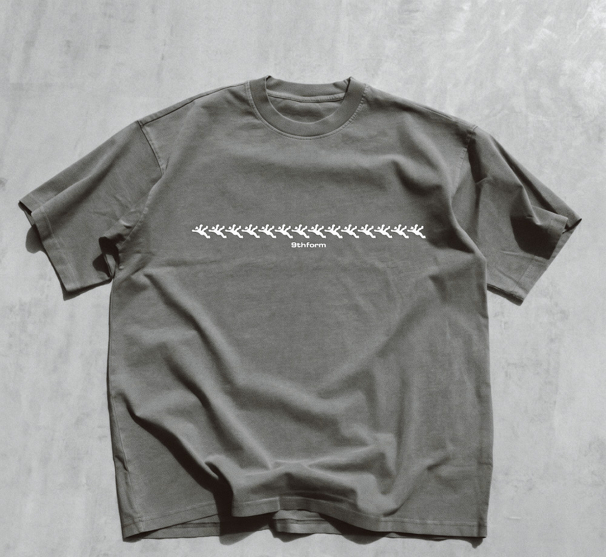

# 9thform

Full-stack e-commerce platform for an action-sports apparel brand — live in production at [9thform.com](https://9thform.com).

## Why I built it

Wanted to ship a real store, not a tutorial clone: real payments, real fulfillment, real customers, and the operational hardening that goes with actually running one — not just a checkout button that works in a demo.

## Tech Stack

React frontend, Firebase (Auth, Firestore, Cloud Functions) backend, Stripe for payments, Apliiq for print-on-demand fulfillment, Resend for transactional email, deployed on Netlify.

## Key technical decisions

- **Automated the full order lifecycle**: Stripe webhook → order saved to Firestore → Apliiq fulfillment API → tracking/delivery emails via Resend, with scheduled polling jobs to catch status changes Apliiq doesn't push.
- **Ran a real OWASP-based security pass** on the production app — authenticated admin routes, input validation middleware, rate limiting, and CSP/security headers.
- **Idempotent, replay-safe webhook handling**: Stripe webhook signature verification preserved through the middleware chain, with numeric order IDs computed deterministically from Firestore string IDs to satisfy Apliiq's numeric-ID requirement without a lookup table.

## Live

**https://9thform.com**

## Docs

- [Product Requirements Doc](9_thform_online_store_prd.md)
